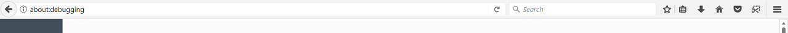
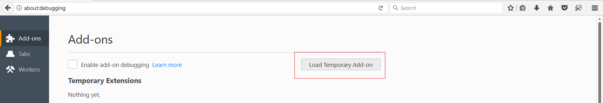
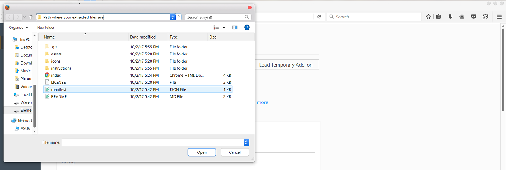
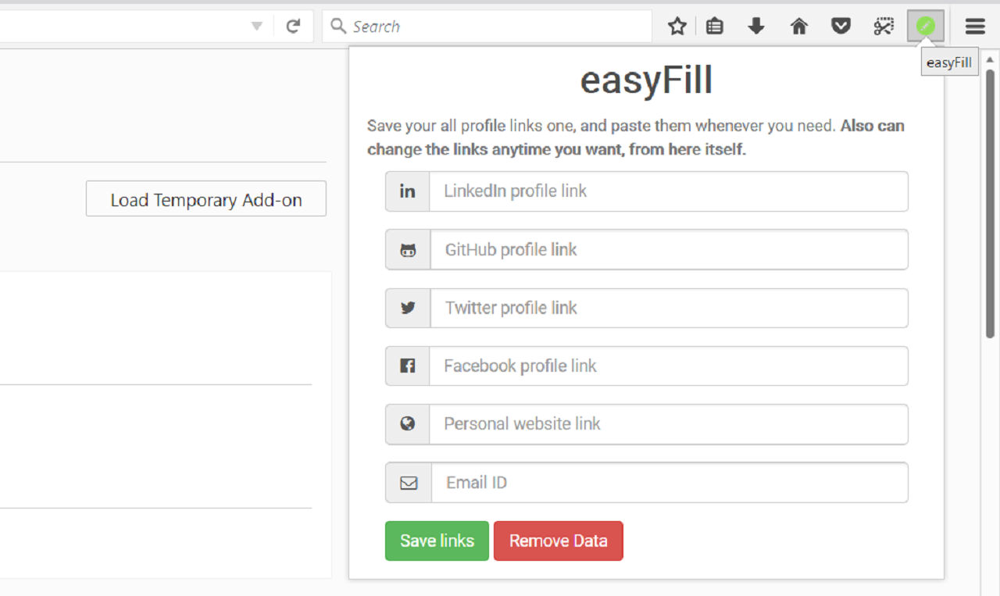

# easyFill

A Mozilla Firefox add-on to keep all your frequently used profile links just a click away.

This Mozilla add-on will enable you to keep all your frequently used profile links avaiable at a click of a button. It saves your links and enables you to use them anywhere.

Usually, people who apply for jobs, fill various forms and create their profiles have to go through the hassle of copying various links like GitHub, LinkedIn etc.. This add-on will help you create profiles in a jiffy.

Just click and voila! you have the link by your side. It helps you get rid of the day to day hassle of opening a new tab, reaching a particular URL and then copying it before the link can be put to some use.

Download this add-on to skip that cumbersome process and jump onto the "put the link to use" part.

Steps to install a local Firefox add-On:

1. Download the zip file and extract the files.
2. In Firefox's address bar type 'about:debugging' and hit enter.

3. Click on 'Load Temporary Add On' button.

4. Navigate through your files to find the folder where you have extracted the files and double click on the 'manifest.json' file.

5. easyFill should now be installed. To use it, Click on  that appears in the toolbar.

Enjoy your easyFill experience :)
